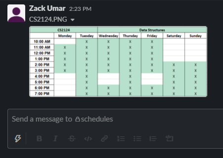
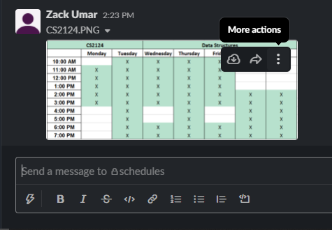
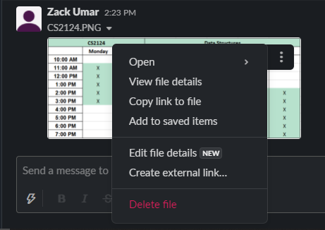

# Bot Instructions

These are instructions to help you get up to speed on how to use the bot.

## Prerequsites
- Python 3
- Pip
- Slack App installed to workspace

## Installation


1. Clone the repo

```sh
git clone https://github.com/zackumar/utsa-cs-bot.git
```

2. Install dependancies using pip

```sh
pip install -r requirements.txt
```

3. Create a file in the root directory called `tokens.py`

```python
SLACK_BOT_TOKEN = "YOUR SLACK BOT TOKEN"
SLACK_APP_TOKEN = "YOUR SLACK APP TOKEN"
```

## Starting the bot for the first time

1. In the courses folder add all your course files.
	- The file names need to match `CS####-###.csv`

2. In the same course folder add `instructors.csv`, `tutors.csv` add `admins.csv`
	- The format of `instructors.csv` and `tutors.csv` go:
		```
		abc123,first_name,last_name,course1,course2...
		```
		-	**Note**: You can use the keyword `all` to be added to all course channels
	
	- The format of `admins.csv` are similar but without courses as admins are added to all channels.
		```
		abc123,first_name,last_name
		```
	- These files should have no header

3. Create a channel called `schedules` and add the bot to this channel

	1. To add a schedule, drag the png into the message box and send it as a file.
		
	2. Hovering over the image, click on the vertical menu that says more actions.
		
	3. Click on `Create external link...`
		
	4. To verify this, `Create external link` should change to `View external link` if you follow the same steps.
	5. Do this for all schedules.

4. Create a channel called `cs-tutor-time-reporting` and add the bot to this channel

5. Create course channels
	- There are two ways to do this.
		-	You can create every course channel manaully and add the bot to it.
		- **This is the easier way.** In workplace settings > preferences, set `People who can create private channels` to `Everyone` and start the bot (or run `/updatelist reset`). You can set this back to your preferred setting after the bot has created the channels. 

6. Run the bot using `run.bat` or `run.sh`!

## How to Update Server after Semester

1. First you need to remove all channels. 
	- To do this, run `/removecourses`. This will delete all the course channels. But not schedules or cs-time-reporting. You can delete those manually if you would like. Make sure to delete all the schedules from the schedules channel if you would like to change those

2. Create all course channels and update backend list
	- As in step 5. in `Starting the bot for the first time`, you can use either way to recreate channels
		- The easiest way is to set `People who can create private channels` to `Everyone` in workplace settings > preferences and run `/updatelist`.
	- If you created channels manually, you will still need to run `/updatelist`. If you want to make students revalidate themselves, use `/updatelist force_verify`.

3. If you did not `force_verify`, you can use `/updatecourse all` and it should move everyone who has already been verified into their new classes and remove them from classes they are no longer in.
